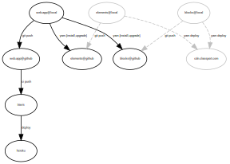

 


## Setting up your environment

### Requirements

* Docker & Docker Compose
* [Heroku CLI tool](https://devcenter.heroku.com/articles/heroku-cli#download-and-install)

### Setup your environment

__1__ - Build your application

```bash
  make lazy
```

__2__ - Ask for help

```bash
  make
```

### Linking dependencies

The web-app depends on two in-house projects, [Elements - A component-based CSS
framework](http:/github.com/querocourses/elements) and [Blocks - A reactive component
library](http:/github.com/querocourses/blocks). Elements is the CSS framework for all
internal components such as: `heros`, `alerts`, `buttons`, `tags`, `cards`, etc. Blocks
is a library of reactive components. Blocks allows you to inject reactive components anywhere 
in your app with ease.
To help your prototype your components inside the web-app, you can simply run

```bash
make yarn-link-elements
make yarn-link-blocks
```

```bash
make yarn-unlink-elements
make yarn-unlink-blocks
```

### Pending Tasks

- [ ] Change all AWS & third-party keys commited on .env.example file | Remove keys
- [ ] Create github -> ci -> heroku workflow
- [ ] Mock OAuths
- [x] Move helpers to a Makefile ?
- [x] Add S3 as a service on docker-compose
- [ ] Create a proxy server for services that don't have a sandbox environment (affiliators)
- [x] Update README.md with an architecture diagram and how it relates to other sub-systems (elements and blocks)

## Running tests

To run the complete test suite (e2e and unit tests)

```bash
  make tests
```

To run e2e tests run

```bash
  make cucumber
```

If you want to debug your running tests, open Chrome and type `http://localhost:9222`

## System Architecture
- [Elements - A component-based CSS framework](http:/github.com/querocourses/elements)
- [Blocks - A reactive component library](http:/github.com/querocourses/blocks)



## SSR

If you want to compile SSR js file, run:

```bash
  yarn ssr
```

Then run the following command to start serving ssr content:

```bash
  node ssr/ssr.js
```