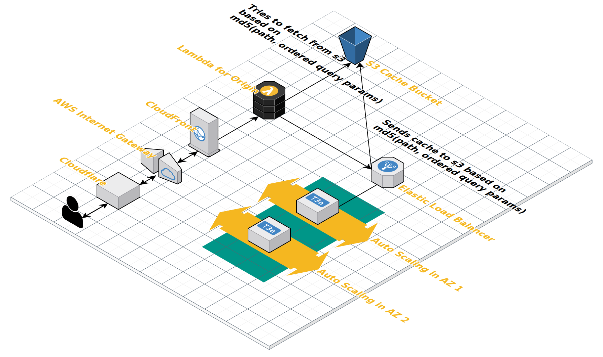

# Respriter

Generate sprites on demand

## How it works

### The basics

Respriter is a simple service that expects SVG sprite URLs (possibly versioned) as inputs
and outputs a subset of the original sprites on a demand basis, using the following API endpoint:

`/:version?files=https://sprite.source.com/sprite.svg&sprite_a=x,y&sprite_b=w,z`

The above means: Get me `<symbols>` x and y from sprite_a and `<symbols>` w and z from sprite_b
located at the `files` endpoint, scoped and cached using `:version` and return me another SVG sprite with all thoses symbols. All `<defs>` that those specific `<symbols>` depend on are also present in the final SVG sprite.

If `:version` is not currently checked out, the server (`server.js`) downloads the specific version to disk onto the `dist/:version` folder and process the download on demand. The processing is done by the `bin/build` ruby binary. The entrypoint for the builder is the `lib` folder. Upon building, the server sends the response to a cache in a s3 bucket, whose name was sent in the `X-Cache-Bucket-Name` request header. In the absence of this header, there's no s3 caching.

## Setup

Run the following commands:

`make setup`

## Infrastructure

### Topology

The infrastructure for the respriter service has the following basic topology:

### Infrastructure (as a) Code

run `cd terraform && terraform init && terraform plan`

## EC2 Image (AMIs)

[Packer](https://www.packer.io/) by Hashicorp™ is a tool to generate images for EC2, Docker, etc based on configuration files. To generate a specific AMI that will be used as base image in an EC2 machine for the respriter service, run:

`packer build packer/ubuntu.json`

P.S.: The above assumes you have `packer` installed on your host machine and
a `$HOME/.aws/credentials` file with a `[mfa]` section. This `[mfa]` section must
be populated with your AWS credentials (including the session token) using MFA.
Refer to [this documentation](https://aws.amazon.com/premiumsupport/knowledge-center/authenticate-mfa-cli/) to read more.

## Deployment

Deployments are triggered using github webhooks on this repository. Just push to the
`production` branch and it will automatically begin.

Deployments are performed through the AWS CodeSuite where there's orchestration for source downloading, service deployment / restarting and load balancing reattachment.

The appspec.yml file controls the [deployment / restarting phase](https://docs.aws.amazon.com/codedeploy/latest/userguide/reference-appspec-file-structure-hooks.html#reference-appspec-file-structure-hooks-list)
