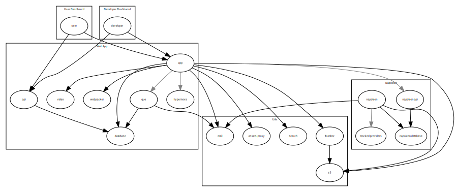

## Setup

### Requirements

- Docker & Docker Compose
- [Heroku CLI tool](https://devcenter.heroku.com/articles/heroku-cli#download-and-install)

### Configure

All configuration should be done by env files located at [envs/](envs/). But hold your horses, only a few files should be edited.

At [envs/dev/](envs/dev/) files are public, not "gitignored" and are supposed to be enough to run properly each service.
If you edit any of those, you must commit your changes or something really awful will happen to you.

But if you just want to debug something or if some service requires some credentials to work, you should use env files
located at [envs/local/](envs/local/). Those files are pre-generated and sometimes holds some production credentials and some options
that may be interesting to you.

To pre-populate [envs/local/](envs/local/) you have to run:

```bash
make configure
```

After running it, is nice to take a look at envs/local/base.env. Commenting and uncommenting some configurations there could
help you increase performance, using some production services instead of running a few on development or help to debug
third party dependencies.

### Configuring Hosts

All domains needs to point to localhost in order to run this on development.

There are two alternatives, adding each one at `/etc/hosts` or adding a reference at `/etc/resolv.conf` to a custom dns server that
will map to all domains.

You will find the configuration that need to be done running `make etc_hosts`.

That task will try to output what should be added in `/etc/hosts` but it can't guess all subdomains.

This task also shows what should be in `/etc/resolv.conf`, and doing so, you don't need to worry about subdomains.

### Setup

This repository sets up 4 projects:

- [Web App](github.com/classpert/web-app)
- [User Dashboard](github.com/classpert/user-dashboard)
- [Developers Dashboard](github.com/classpert/developers-dashboard)
- [Napoleon](github.com/classpert/napoleon)

To set up each of these, you can run:

```bash
make setup-app
make setup-user
make setup-developer
make setup-napoleon
```

To set up web app database you need to run this:

```bash
make setup-database
```

If you think that it is too much, you are right! You could just `make setup` and everything should have being done for you
but if I said that before, maybe you would take longer to know that most of it is unnecessary if you don't want to set up
everything in the first place.

### Troubleshooting

Most of those setups tasks requires permission in some projects hosted at Heroku. If you don't have those permissions,
some tasks may break.

## Working with the Services

### Services Dependencies

All services from this project are listed on [docker-compose.yml](/docker-compose.yml).
A summary of those with all dependencies are shown below:



This repository is equipped with a nice [Makefile](/Makefile) that runs all services nicely, orquestrating dependencies when necessary.

In the diagram above you can see those dependencies represented as black and grey arrows.
The blacks are dependencies that will be automatically started when a given service is requested to start,
the gray ones are optional dependencies that you may want to run together, but if thats the case, you must invoke them manually.

### Running Services

There are two families of tasks to run services:

- `up-%` tasks: runs services attached to it
- `run-%` tasks: runs services in background

The possible services are:

- **app**: Main Rails Web App
- **que**: Backgroud Processing Service for Web App
- **ssr**: Hyprnova Service for Server Side Rendering
- **webpacker**: Webpack Dev Server for Web App Assets
- **database**: Postgres Database for Web App
- **api**: PostgREST API for Web App's Database
- **video**: Video Service that redirects to videos to provider's signed URLs
- **search**: ElasticSearch
- **thumbor**: Thumbor Service
- **mail**: Mailcatcher
- **s3**: Mocked S3 Service
- **assets-proxy**: Development Proxy that maps production assets on development environment
- **user**: User Dashboard Vue App
- **developer**: Developers Dashboard Vue App
- **napoleon**: Napoleon Worker
- **database.napoleon**: Postgres Database for Napoleon
- **api.napoleon**: PostgREST API for Napoleon's Database
- **provider**: Static server that provides mocked pages to debug Index Tool
- **proxy**: Ingress Service that proxies calls to every http server of this project
- **volumes**: Creative solution to edit dependencies in runtime

There are some aliases like:

- `make up-persistence`: Runs all Web App peristence related services (database, s3, search)
- `make up-all`: Runs all services, except volumes service (because this one is just for debugging)

To stop services, you could use `make down-%` to stop each service or `make restart-%` o restart each service.

There is also the `make down-all` aliased to `make down` and `make clean` to stop all services.

Another more harsh cleanup could be done with `make wipe` if you want to delete all volumes as well.

It is not a great idea to blow everything away with `make wipe`, sometimes you just want to cleanup data volumes,
and not the ones that keep dependencies as gems and node modules. In that case, you `make wipe-data` to cleanup those
services. Keep in mind that `make wipe-data` should be used with persistence containers down.

Even more simpler, if you need to wipe only database there is task for that: `make wipe-db`

There is another wipe task, but its use is not advised. `make wipe-unnamed-volumes` has a misleading name, actually it
destroy all volumes that are not named as `web-app-*`, so the host will have all volumes erased, but the named volumes
in this project (even other named volumes from other projects will go to space). It is very destructive task, but it
is useful if your machine is full of trashed volumes an that is compromising your workflow.

### Shells

If you want to access any service shell, you can use 4 families of tasks:

- `bash-%`: opens a `bash` shell in a given container
- `bash-ports-%`: opens a `bash` shell in a given container with service ports
- `sh-%`: opens a `sh` shell in a given container
- `sh-ports-%`: opens a `sh` shell in a given container with service ports

There is 3 alias as well:

- `tty`: to `bash-base`
- `bash`: to `bash-base`
- `bash-ports`: to `bash-ports-app`

You may notice that I didn't described the **base** service before but in the alias I access a shell on it.
This service are just a docker-compose service that servers as an abstract class of main Web App services,
but it is extremally useful since it has no dependency. So if you run `make bash-app`, all app dependencies
will run, but if you run `make bash-base` nothing but web app container will run. So if you want dependencies
to be up, please run make `bash-app`, if not, run just `make bash`.

### Consoles

If you want to run a rails console you can just run `make console` inside or outside a docker container. It will detect the context and then invoke itself in a proper way.

One more thing to say is that `make console` is actually an alias for `make console-%` where possibilies could be:
`console-dev`, `console-stg` and `console-prd`.

So now you don't need to write a long command do to something so simple as running a production console, if that's
the case, just run `make console-prd`

### Other Useful Web App Tasks

Like console tasks, we have a few more task that deserve mention, are those:

- `npm-install`: invoke `npm install`
- `npm-install-save-exact`: invoke `npm install --save-exact` so it will not update package-lock.json
- `bundle-install`: invoke `bundle install`
- `rails-migrate`: run rails migrations (probably you will not need this task, see more about database tasks in other section)
- `course-reindex`: reindex ElasticSearch recreating all data (or creating it for the first time)
- `sync-%`: could be `sync-crawling_events` or `sync-courses` to sync Napoleon resources for those given types
- `sync`: is an alias to `make sync-crawling_events sync-courses` in that order

All those tasks are magically done in order to be able to run inside or outside docker context like `make console`,
but unlike `console` they dont have a sufix that enable their execution at production or staging environments.
To do so, look at the next section.

### Running Tasks at Production and Staging

A few tasks like `course-reindex` or `sync` from previous section are desirable to be used in production or staging.
To do so, we have 2 families for tasks:

- `attached-(prd|stg)-%`: Runs attached at production or staging web app heroku environment a given make task
- `detached-(prd|stg)-%`: Runs detached at production or staging web app heroku environment a given make task

So, for example, if you want to reindex courses on production not waiting for this long running task to run, just do:

```bash
make detached-prd-course-reindex
```

### Bundler and Node Modules Dependencies

You can use installed or volumes dependencies. By default installed dependencies are way faster in OSX, but on
Linux this doesn't make any difference.

If you want to use volume dependencies you must go to the pre-generated envs/local/base.env file and uncomment `BUNDLE_PATH`
and `NODE_PATH` variables.

One more thing related to it, is that volume dependencies are the only ones you can update with `npm install` or `bundle install`.
Installed dependencies are per container and not shared along other containers, so if you run those commands you will only
update `Gemfile.lock` and `package-lock.json` you'll need to run `make docker-build` to have those images propagated.

One last detail: if you change the value of `NODE_PATH` env variable, you need to delete symlink file node_modules in
order to make everything work, so after deleting it, you need to recreate all containers with `make down` so the changes will
take effect.

### Database Tasks

The most useful task to handle database is `make db-prepare`. It stops the database (if it's running), wipes it (if exists)
,creates a brand new one (with migrations), gets up all persistence containers and reindex data on ElasticSearch.

Actually this task is an alias for all previously mentioned tasks. Yes, I didn't mention seeds... There is no task to
run seeds, let me explain better how this is done.

Seed data is created when database container start to run for the first time (or when data volume is empty). In order to
do so, it uses a subset of sanitized data from production that is created by a "gitignored" script at
images/database/production_seed.sql. This script is dynamically created when you run `make setup-database`, which in turn
creates some csv files at db/seeds/ folder. All "gitignored" seed data extracted from production will live under db/seeds/ as well.

One more nice detail about this seed is that every password for user or admin is overwritten to abc123, so it makes everything easier to debug!

If you implement a new feature or changed the database structure in a way that you may break this auto-generation of seeds,
please, be kind enough to fix it, look at the task `db-build-seeds` at [Makefile](Makefile) and be polite
to allow other people to continue using this feature for their daily work.

If you really don't want a subset of database, you can download it with `make db-download` then `make db-load`.

Actually `make db-load` is an alias for `make db-load-%` that works like console task, so if you want to restore staging
environment from your local dump data, you can run `make db-load-stg` to do so. But, please be careful, because it is possible
to replace production data from your dump with `make db-load-prd` if you are a crazy guy, or is fixing some crazy guy's mistake.

Another useful task is `make db-migrate` that apply migrations over database. This tasks is another alias as console task, so
if you run `make db-migrate-prd` you can migrate production database.

## Debugging

### Watch Environment

There is a simple task `make watch-%` that refreshs each 5 seconds to see with containers or heroku processes are running.
For each env, you can run: `watch-dev`, `watch-stg` and `watch-prd`.

You have an alias to `watch-dev`, so it is simpler to use `make watch` for it.

### Logs

There is a task called `make logs-%` that looks simple, but it does a lot of stuff.

If you give an environment like `logs-dev`, `logs-stg` or `logs-prd`, you see live logs of all containers or dynos of each environment.

If you give a service, you get live logs for a given development container that matchs, e.g. `logs-database` shows live logs of
development database.

There is also a `make logs` that is an alias to `make logs-dev`.

#### Log Draining

In the Developers Dashboard, there's a service called [Classpert's Logdrain](https://github.com/classpert/logdrain) that
receives logs from Heroku and exposes them in a RESTful API to be consumed.

To replicate this functionality in a development environment, whenever you spin up Developers Dashboard (`make up-developer`, for example), 4 additional logging services will spin up as well:

- [Logspout](https://github.com/gliderlabs/logspout): This service exposes all Docker container logs in a never-ending consumable stream of logs through an HTTP server, located at http://logspout.clspt/logs. This server will only expose container logs for which the environment variable `LOGSPOUT` **was not** set to `ignore`. Currently, only the `que.clspt` service's logs are exposed.
- [Heroku's Logshuttle](https://github.com/heroku/log-shuttle): This service is responsible to collect and cleanup the logs coming from Logspout and redirect them to a Logplex node (see below) in a syslog format.
- [Heroku's Logplex](https://github.com/heroku/logplex): This service is responsible to collect logs in syslog format (either from the system's syslog facility or from a logshuttle node) and distribute them to logdraining endpoints (The creation of the logdraining endpoint is done in the logshuttle service, during boot, using logplex's API)
- [Classpert's Logdrain](https://github.com/classpert/logdrain): The service to which Logplex `POST`s log packets to, after which you can consume in a RESTful fashion (logs endup being exposed at a URL like `http://logdrain.clspt/logs/<ID>.json`).

### Debugging Dependencies Editing its Source

Since OSX and Linux have a few differences regarding filesystem, mounting binded volumes requires huge IO at OSX, so running rails
at docker with dependencies as mounted volume is ~60x slower. Even keeping those data in not mounted volumes is slow.

Long story short: Docker Team designed volumes to have high consistency between host and container, in Linux this is given for free,
but in OSX this comes with a price that they are willing to pay. So don't expect docker volumes to get faster on OSX.
We need workarounds.

I read a about a few, and right now I am using, for ruby containers, a cached volume. Cached volumes don't have this high consistency
constraint, so their filesystem changes or events can delay do be propagated from host to container, but they don't require IO all
the time between container and host.

Not only that, I moved those dependencies to named volumes that are shared with host by a SFTP service called **volumes** and
instrumentalized it with tasks to connect/disconnect to it.

So if you want to edit web app's **node_modules** or **bundle** you can run `make volumes-show` or `make volumes-hide` to connect and
disconect the volumes folder located in the root of this project.

By default, in order to get more performance, the given container use installed gems instead of ones in volumes, to use those,
you need to uncomment `BUNDLE_PATH` env at generated `envs/local/base.env` env file.

Right now `node_modules` are in a volume, but soon I will change it, so by default it will use installed modules like it is done
with gems, having a config to change it, I just need to find a proper way to do so, but I am close to it.
